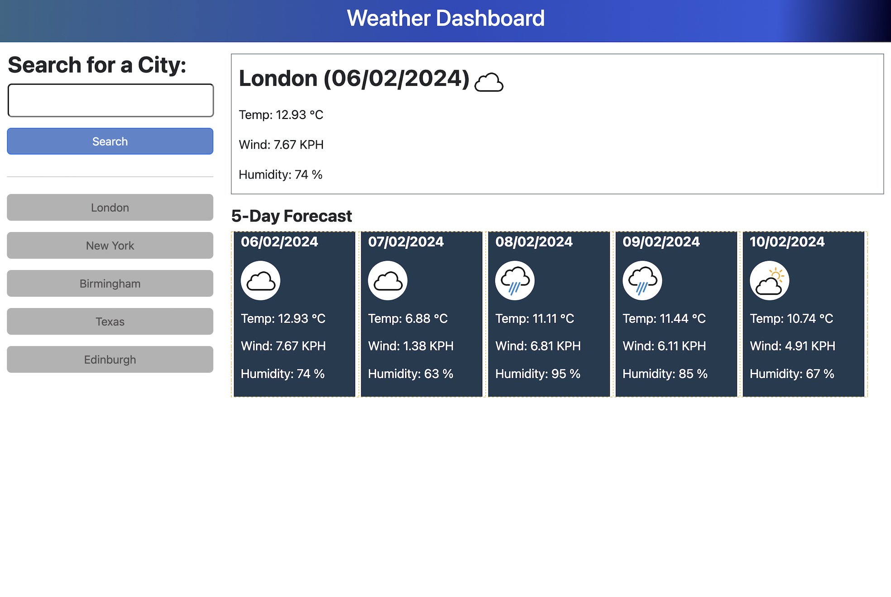

# Weather Dashboard App (Module 8 Challenge)
My submission for the Module 8 Server-Side API Weather Dashboard challenge

## Description

My submission for the Module 8 Server-Side API challenge. The challenge was to create a Weather Dashboard app to return a 5 day forecast using The OpenWeatherMap API. Styling was guided by a provided mockup image.

## Installation

N/A

## Usage

The webpage can be accessed via the following url: https://jonathon10k.github.io/Weather-Dashboard

## Credits

N/A

## License

N/A